# PZIO - Podręcznik Użytkownika

## 1. Instalacja i konfiguracja

Aplikacja PZIO w architekturze backend+frontend tworzy powiązane usługi i bazę danych automatycznie w filozofii _zero configuration_.

Zestawienie środowiska można przeprowadzić na dwa sposoby:

### Sposób 1: Docker (Sposób zalecany)

Dzięki wykorzystaniu Docker Compose całe środowisko wraz z bazą PostgreSQL i serwerami zostaje uruchomione jedną komendą.

1. Skopiuj przykładowy plik konfiguracyjny (zawierający m.in. klucz JWT):
    ```bash
    cp .env.example .env
    ```
2. Zbuduj i uruchom stos kontenerów:
    ```bash
    docker compose up --build
    ```

Aplikacja będzie dostępna pod adresem: **http://localhost:5173**  
Dokumentacja API (Swagger) pod adresem: **http://localhost:8000/docs** lub w podfolderze repozytorium: `/docs/api`

> **Uwaga (Środowisko produkcyjne):** Wartość `JWT_SECRET` w skopiowanym pliku `.env` jest celowo testowa. Przed każdym wejściem na produkcję musisz nadpisać ten klucz długim i losowym ciągiem znaków. Backend odmówi startu, jeśli w ogóle go nie zdefiniujesz.

### Sposób 2: Uruchamianie klasyczne (komendy lokalne)

Aplikację można też uruchomić tradycyjnie, ręcznie instalując niezbędne komponenty oddzielnie dla backendu oraz frontendu.

**Backend:**

```bash
cd backend
cp .env.example .env
python3 -m venv .venv
source .venv/bin/activate
pip install -e .
python -m pzio
```

API wystartuje pod: `http://localhost:8000`.

**Frontend:**
Otwórz drugą zakładkę terminala i wykonaj:

```bash
cd frontend
npm install
cp .env.example .env
npm run dev
```

Domyślnie użyje on adresu `http://localhost:8000` dla backendu. Frontend ruszy pod adresem `http://localhost:5173`.

> _Użytkownicy Nix:_ W głównym roocie projektu znajduje się również plik `shell.nix`. Możesz skorzystać po prostu z komendy `nix-shell` z roota, aby szybko ustawić wyizolowane środowisko systemowe.

### Konfiguracja logowania przez Google / GitHub (OAuth2) — opcjonalne

Aplikacja umożliwia logowanie zewnętrznym kontem Google lub GitHub. **Ta opcja jest wyłączona dopóki administrator nie skonfiguruje danych uwierzytelniających.** Jeśli żaden dostawca nie jest skonfigurowany, frontend ukrywa odpowiednie przyciski na ekranach logowania i rejestracji — użytkownik widzi wtedy wyłącznie klasyczny formularz e-mail + hasło.

Każdy dostawca wymaga zarejestrowania aplikacji w jego panelu i przeniesienia dwóch wartości (Client ID i Client Secret) do zmiennych środowiskowych PZIO. Frontend potrzebuje **tylko Client ID** (publiczna wartość — startuje flow OAuth w przeglądarce). Backend potrzebuje **Client ID i Client Secret** (weryfikuje token zwrócony przez dostawcę). Sekret nigdy nie trafia do zmiennych z prefiksem `VITE_*`, bo te są wbudowywane w bundle frontendu.

**Adres przekierowania zwrotnego (Redirect URI)** dla obu dostawców to:

- środowisko lokalne (dev): `http://localhost:5173/oauth/callback`
- środowisko produkcyjne: `https://<twoja-domena>/oauth/callback`

#### Google

1. Wejdź do [Google Cloud Console](https://console.cloud.google.com/) i wybierz (lub utwórz) projekt.
2. Z menu wybierz **APIs & Services → OAuth consent screen** i skonfiguruj ekran zgody (typ aplikacji: External, podaj nazwę aplikacji i adres e-mail kontaktowy). Dodaj `email` i `profile` do scope'ów.
3. Następnie **APIs & Services → Credentials → Create credentials → OAuth client ID**. Wybierz typ **Web application**.
4. W polu **Authorized redirect URIs** dodaj adres zwrotny (jak wyżej — `http://localhost:5173/oauth/callback` lub produkcyjny odpowiednik).
5. Skopiuj wygenerowane **Client ID** i **Client Secret** — wartości wpiszesz do pliku `.env` w sekcji „Gdzie wpisać wartości” niżej.

#### GitHub

1. Wejdź do [GitHub → Settings → Developer settings → OAuth Apps](https://github.com/settings/developers) i kliknij **New OAuth App**.
2. Wypełnij formularz:
   - **Application name** — dowolna nazwa.
   - **Homepage URL** — np. `http://localhost:5173` (dev) lub adres produkcyjny.
   - **Authorization callback URL** — `http://localhost:5173/oauth/callback` (dev) lub `https://<twoja-domena>/oauth/callback` (prod).
3. Po zapisaniu skopiuj **Client ID** i wygeneruj **Client Secret** (przycisk *Generate a new client secret* — wartość pokaże się tylko raz).

#### Gdzie wpisać wartości

Sposób różni się w zależności od tego, którym sposobem (z rozdziału 1) uruchamiasz aplikację:

**Sposób 1 — Docker (zalecany).** Wszystkie zmienne idą do **jednego** pliku `.env` w katalogu głównym repozytorium (ten sam, w którym trzymasz `JWT_SECRET`). Docker Compose automatycznie odczyta go i przekaże dalej — do backendu jako runtime env, do frontendu jako build args (zob. `docker-compose.yml`, sekcje `backend.environment` i `frontend.build.args`):

```
GOOGLE_CLIENT_ID=...
GOOGLE_CLIENT_SECRET=...
GITHUB_CLIENT_ID=...
GITHUB_CLIENT_SECRET=...
VITE_GOOGLE_CLIENT_ID=...
VITE_GITHUB_CLIENT_ID=...
```

Wartości `VITE_*` zazwyczaj są **identyczne** z `GOOGLE_CLIENT_ID` / `GITHUB_CLIENT_ID` — Vite wymaga prefiksu `VITE_`, żeby zmienna trafiła do bundle'a frontendu. Sekrety (`*_SECRET`) **nigdy** nie dostają prefiksu `VITE_`, bo bundle frontendu jest publiczny.

**Sposób 2 — uruchamianie klasyczne.** Zmienne dzielą się na dwa pliki:

- `backend/.env`: `GOOGLE_CLIENT_ID`, `GOOGLE_CLIENT_SECRET`, `GITHUB_CLIENT_ID`, `GITHUB_CLIENT_SECRET`.
- `frontend/.env`: `VITE_GOOGLE_CLIENT_ID`, `VITE_GITHUB_CLIENT_ID`.

#### Po zmianie konfiguracji — restart

Backend wczytuje zmienne **runtime'owo** przy starcie procesu, więc wystarczy odtworzyć kontener / proces:

- Docker: `docker compose up -d backend`. **Nie** `docker compose restart backend` — `restart` jedynie restartuje proces wewnątrz istniejącego kontenera, więc świeżo dodane zmienne w `.env` nie zostaną odczytane. `up -d` porównuje konfigurację z aktualnym kontenerem i odtwarza go, jeśli coś się zmieniło.
- klasyczne: zatrzymaj i ponownie uruchom `python -m pzio`.

Frontend **wbudowuje** wartości `VITE_*` w bundle JS w momencie buildu — sam restart nic nie da, bo wcześniej zbudowane pliki nadal zawierają stare wartości. Trzeba przebudować:

- Docker: `docker compose up --build` (`--build` jest kluczowe — bez tego Compose użyje starego obrazu).
- klasyczne: zatrzymaj i ponownie uruchom `npm run dev` — dev-server Vite czyta `frontend/.env` na starcie.

Skonfigurowanie tylko jednego dostawcy jest w pełni dozwolone — frontend pokaże wtedy tylko ten jeden przycisk, a backend obsłuży tylko ten provider.

## 2. Baza danych i zasady środowiskowe

- **Pierwszy zarejestrowany użytkownik** uzyskuje automatycznie najwyższe uprawnienia: **Administrator**.
- **Każdy kolejny** staje się domyślnie **Team Memberem**.

_Uwaga deweloperska:_ Przypominanie haseł póki co używa komponentu `MockEmailService`. Aplikacja nie wysyła fizycznie e-maili, ale zapisuje requesty resetu w bazie danych.

## 3. Sposób użycia - Funkcjonalności

Poniżej znajdziesz zestawienie widoków we frontendzie.

### Logowanie (`/login`)

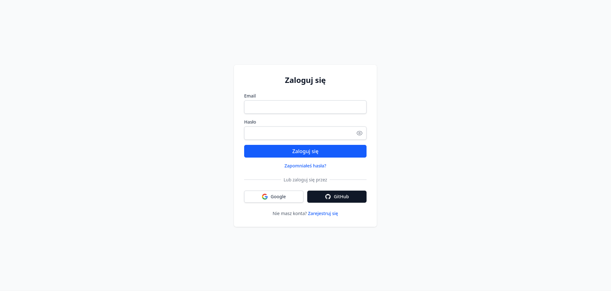

- Ta strona jest punktem startowym dla wszystkich użytkowników.
- Umożliwia uwierzytelnienie się za pomocą adresu e-mail i hasła.
- Po pomyślnym zalogowaniu następuje przekierowanie do strony głównej.
- Można też przejść do ekranu rejestracji lub zapomnianego hasła, jeśli nie masz jeszcze konta lub potrzebujesz zresetować hasło.
- Dostępna jest również opcja logowania przez Google lub GitHub (OAuth2) — po kliknięciu następuje przekierowanie do odpowiedniego dostawcy, a po udanym uwierzytelnieniu powrót do aplikacji z zalogowanym użytkownikiem. Przyciski OAuth są widoczne tylko dla tych dostawców, których administrator wcześniej skonfigurował — zob. sekcję „Konfiguracja logowania przez Google / GitHub (OAuth2)” wyżej.

### Rejestracja (`/register`)

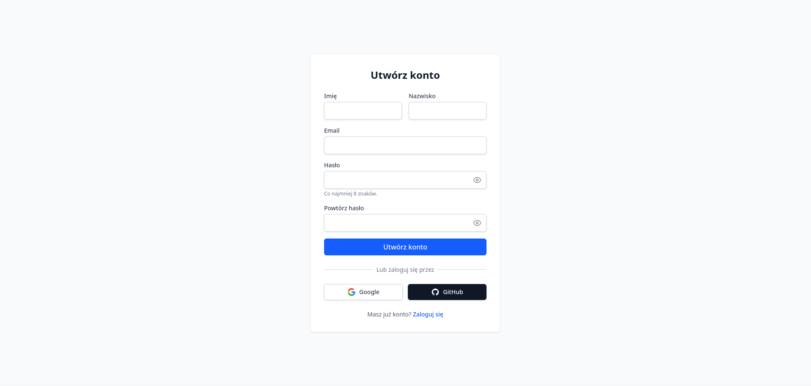

- Ta strona umożliwia tworzenie nowego konta w systemie.
- Użytkownik musi podać swój adres e-mail, dane osobowe, hasło oraz potwierdzenie hasła.
- Po pomyślnym zarejestrowaniu następuje przekierowanie do strony logowania, gdzie można się zalogować nowo utworzonym kontem.
- Dostępna jest także opcja powrotu do ekranu logowania oraz rejestracji przez OAuth2.

### Zapomniane hasło (`/forgot-password` i `/reset-password`)

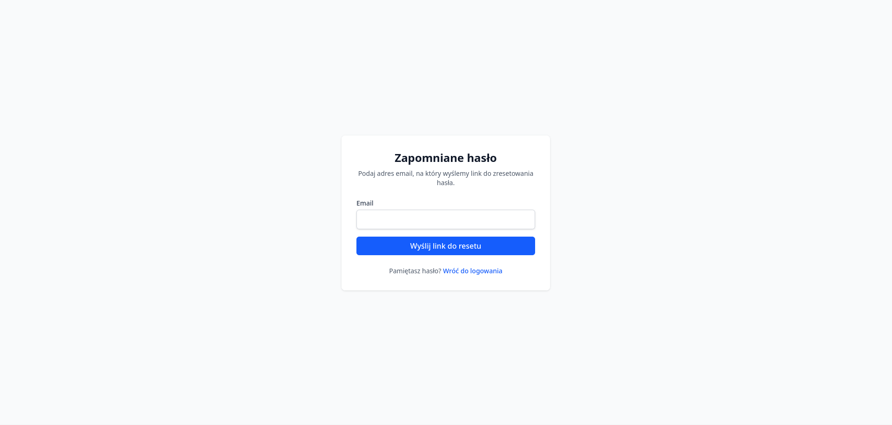

- Jest to prosty widok umożliwiający użytkownikom zainicjowanie procesu resetowania hasła poprzez podanie swojego adresu e-mail.
- Po wysłaniu formularza, docelowo ma być wysyłany e-mail z linkiem do resetowania hasła. W obecnej implementacji, ze względu na użycie `MockEmailService`, żaden e-mail nie jest faktycznie wysyłany.

### Strona główna (`/`)

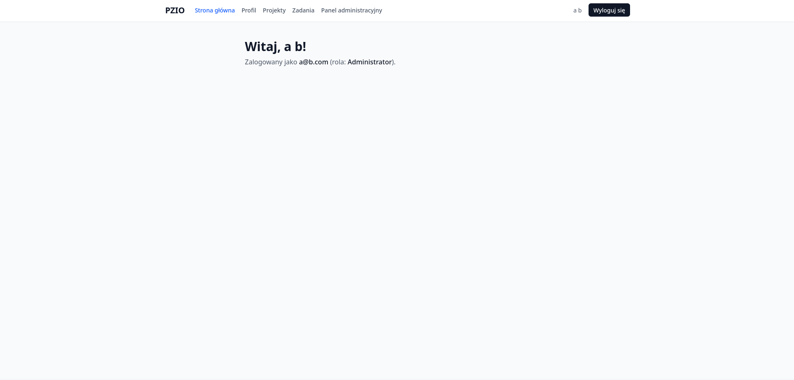

- Ekran powitalny witający zalogowanego użytkownika.
- Dostęp nawigacyjny do reszty ekosystemu - głównie do listy projektów i zadań, a także do profilu użytkownika i panelu administratora (jeśli użytkownik ma odpowiednie uprawnienia).
- Aktualnie dość pusta, ale docelowo będzie zawierała różne widżety i skróty do najważniejszych funkcji.

### Projekty (`/projects`)

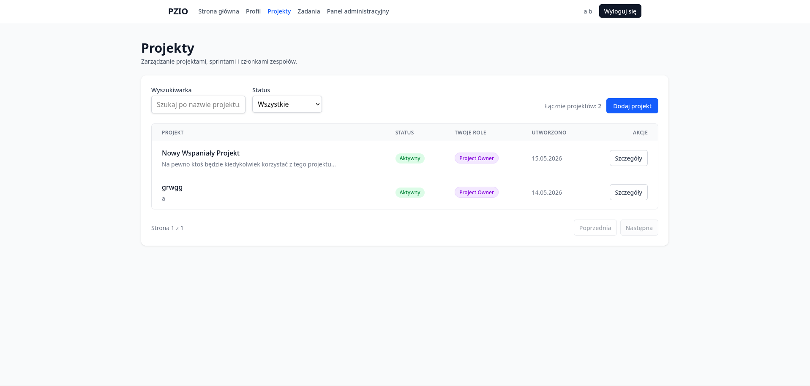

- Wyświetlanie listy wszystkich projektów, do których użytkownik ma dostęp.
- Możliwość tworzenia nowych projektów przez użytkowników z rolą systemową Administratora lub Managera.
- Możliwość filtrowania i sortowania projektów według różnych kryteriów.

### Szczegóły projektu (`/projects/:id`)

Widok ten jest podzielony na wiele sekcji, które udokumentowano poniżej.

**Sekcja informacji o projekcie**:

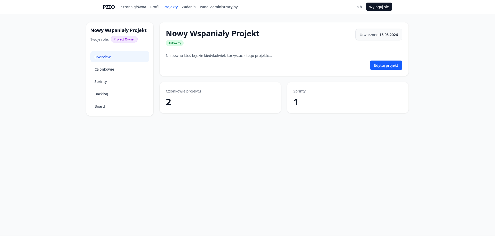

- Zawiera podstawowe informacje o projekcie, takie jak jego nazwa, opis i data utworzenia.
- Pozwala na edycję tych informacji przez użytkowników z odpowiednimi uprawnieniami.

**Sekcja członków projektu**:

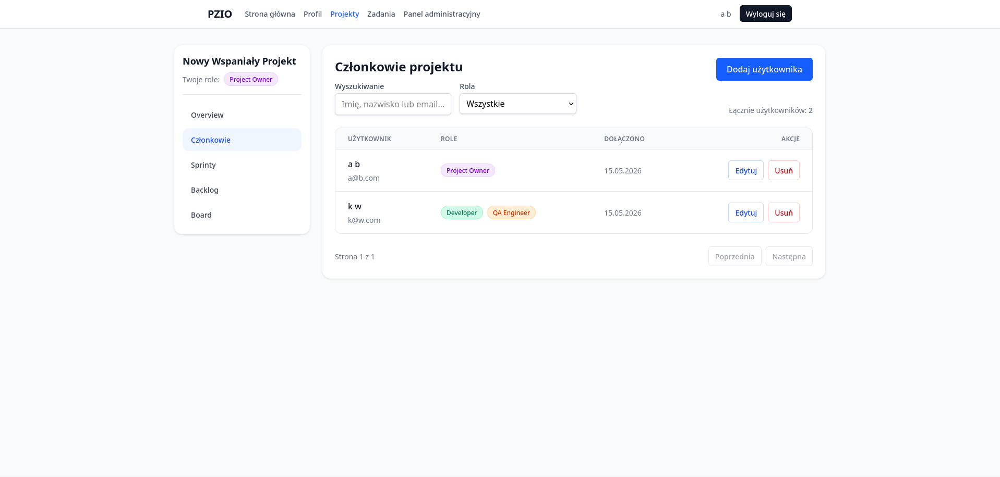

- Wyświetla listę wszystkich członków projektu wraz z ich rolami.
- Umożliwia dodawanie nowych członków do projektu oraz zarządzanie ich rolami poprzez przycisk "Edytuj" obok każdego członka.
- Umożliwia usuwanie członków z projektu, jeśli użytkownik ma odpowiednie uprawnienia.
- Dostępne jest także wyszukiwanie członków oraz filtrowanie po rolach, a także paginacja.

**Sekcja sprintów**:

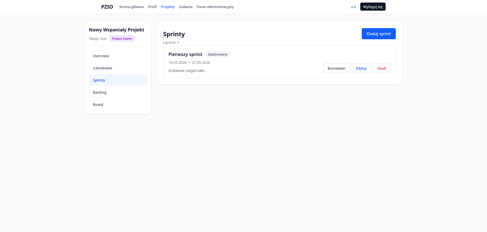

- Pozwala na zarządzanie sprintami w ramach projektu, w tym tworzenie nowych sprintów, edycję istniejących oraz usuwanie sprintów.
- Każdy sprint ma swój opis oraz daty rozpoczęcia i zakończenia.
- Dostępny jest także przycisk "Burndown", służący do wizualizacji postępu sprintu w formie wykresu burndown.

**Sekcja zadań (backlog)**:

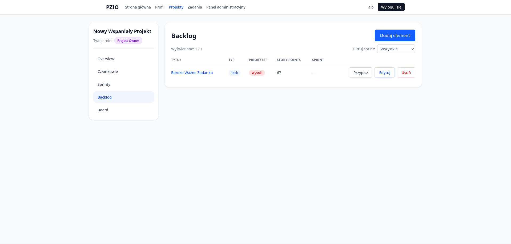

- Ta sekcja zawiera listę wszystkich zadań w danym projekcie, które nie zostały jeszcze przypisane do sprintu.
- Umożliwia tworzenie nowych zadań, edycję istniejących oraz usuwanie zadań.
- Zadania można przypisywać do sprintów, klikając w przycisk "Przypisz".
- Wyświetlane są podstawowe informacje o zadaniu, takie jak jego tytuł, typ, priorytet oraz story points.

**Tablica zadań (kanban)**:

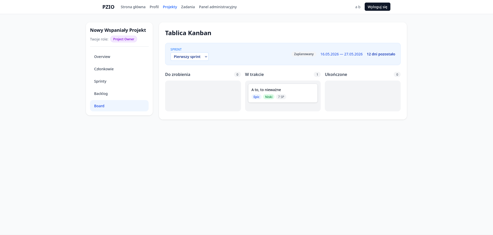

- Tablica zadań w stylu kanban, podzielona na kolumny reprezentujące różne statusy zadań ("Do zrobienia", "W trakcie", "Ukończone").
- Umożliwia przeciąganie i upuszczanie zadań między kolumnami, co automatycznie aktualizuje ich status.
- Wyświetlane są również informacje o sprincie, dla którego widoczna jest aktualnie tablica.
- Kliknięcie na zadanie przenosi do jego szczegółowego widoku, gdzie można zobaczyć więcej informacji oraz edytować zadanie.

### Zadania (`/tasks`)

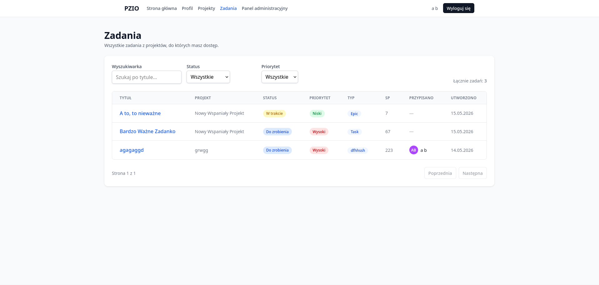

- Jest to widok zbiorczy, który wyświetla wszystkie zadania, do których użytkownik ma dostęp, niezależnie od projektu.
- Umożliwia filtrowanie zadań według statusu i priorytetu oraz wyszukiwanie zadań po tytule.
- Kliknięcie na zadanie przenosi do jego szczegółowego widoku.

### Szczegóły zadania (`/tasks/:id`)

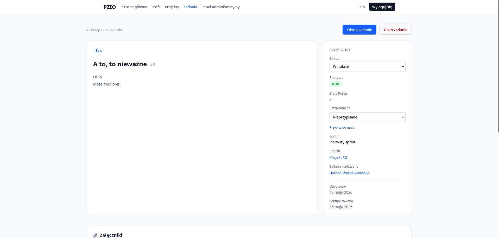
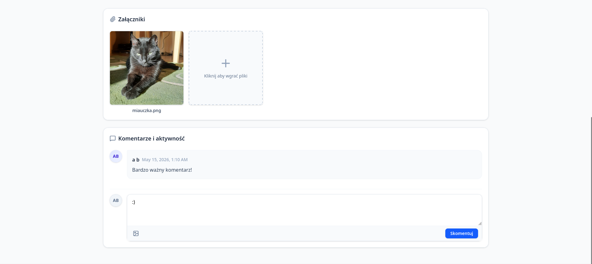

- Wyświetla wszystkie informacje o zadaniu, takie jak: tytuł, opis, typ, priorytet, story points, status, przypisany sprint, identyfikator wewnętrzny oraz zadanie nadrzędne.
- Umożliwia edycję tych informacji przez użytkowników z odpowiednimi uprawnieniami.
- Pozwala na dodawanie komentarzy do zadania, co jest szczególnie przydatne do komunikacji między członkami zespołu.
- Dostępna jest również dedykowana sekcja na załączniki, gdzie można dodawać i przeglądać pliki powiązane z zadaniem. Zdjęcia dodane jako załączniki są wyświetlane bezpośrednio w tej sekcji, co ułatwia ich przeglądanie.

### Profil Użytkownika (`/profile`)

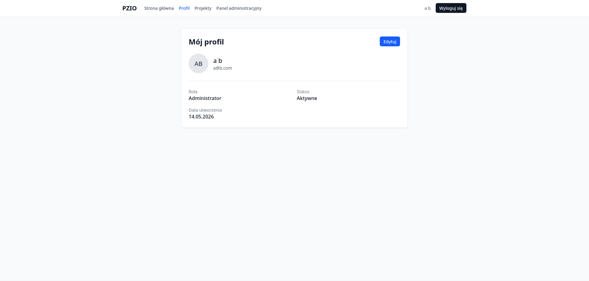

- Wyświetlanie aktualnych informacji na swój temat (imię, nazwisko, adres e-mail, rola, status).
- Możliwość edycji podstawowych danych osobowych, takich jak imię, nazwisko i adres URL awatara.
- Możliwość zmiany adresu e-mail przypisanego do konta.
- Możliwość zmiany aktualnego hasła (ze względów bezpieczeństwa operacja ta wymaga podania dotychczasowego hasła).
- **Strefa niebezpieczna:** Możliwość trwałego i bezpowrotnego usunięcia własnego konta z systemu.

### Panel Administratora (`/admin`)

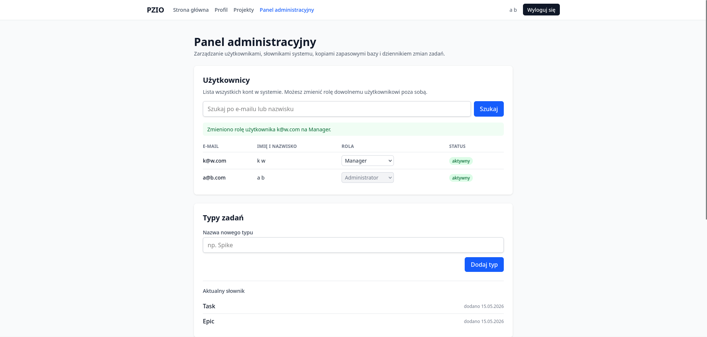
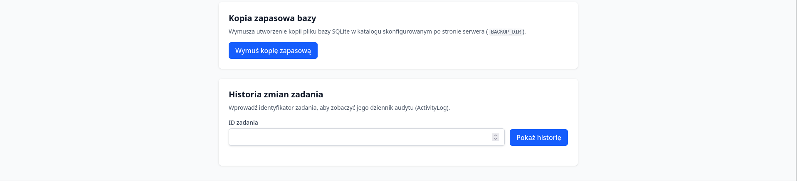

- Panel dedykowany do zarządzania kontami użytkowników, backupami bazy danych i innymi funkcjami administracyjnymi.
- Dostęp do tego panelu mają tylko użytkownicy z rolą Administratora.
- Pierwsza sekcja umożliwia przeglądanie listy wszystkich zarejestrowanych użytkowników, wraz z ich rolami i możliwością edycji tychże ról.
- Druga sekcja pozwala na rozszerzanie dostępnych typów zadań projektowych o nowe definicje, a także usuwanie istniejących typów zadań, o ile nie jest to ostatni pozostały typ.
- Trzecia sekcja służy do wymuszania stworzenia kopii zapasowej bazy danych.
- Czwarta sekcja pozwala na przeglądanie logów powiązanych z konkretnym zadaniem projektowym, co jest szczególnie przydatne do celów debugowania i monitorowania.
